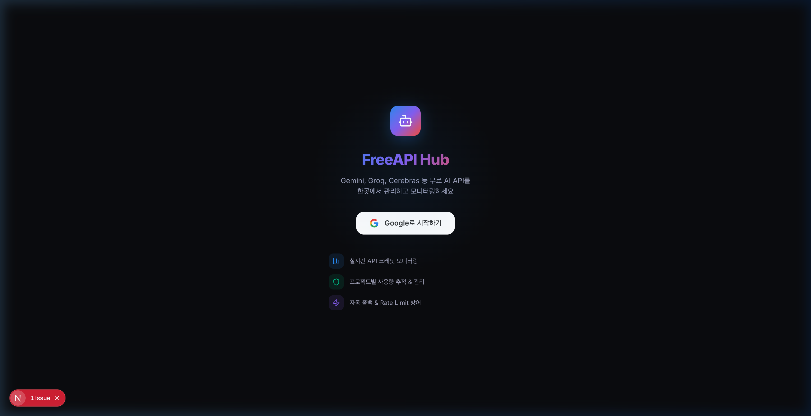

<p align="center">
  
</p>

<h1 align="center">FreeAPI Hub</h1>
<p align="center">
  <strong>무료 AI API를 하나의 대시보드에서 통합 관리하고, 실시간 모니터링하세요.</strong>
</p>
<p align="center">
  Gemini · Groq · Cerebras — 할당량 추적, 자동 폴백, AI 간 토론까지
</p>
<p align="center">
  
  
  
  
  
</p>

---

## 왜 FreeAPI Hub인가?

무료 AI API는 강력하지만, **흩어진 키 관리**, **예측 불가능한 할당량 소진**, **갑작스러운 rate limit**이라는 반복적 고통이 따릅니다.

**FreeAPI Hub**는 이 문제를 통합 대시보드로 해결합니다:

| 😰 기존의 고통 | ✅ FreeAPI Hub |
|----------------|----------------|
| 키를 여기저기 텍스트 파일에 보관 | Firebase 기반 암호화 저장, 한 곳에서 관리 |
| 어느 키가 소진됐는지 모름 | 실시간 잔여 할당량 게이지로 한눈에 확인 |
| Rate limit → 서비스 중단 | 자동 폴백 + 지수 백오프로 무중단 |
| 프로젝트별 사용량 추적 불가 | 프로젝트 태깅 & 비용 시뮬레이션 |
| 프롬프트/응답 기록 없음 | QA 로그 자동 기록 & 검색 |

---

## 스크린샷

<p align="center">
  
  <br />
  <em>Google OAuth로 30초 만에 시작 — 다크 테마 기본 적용</em>
</p>

---

## 핵심 기능

### 📊 실시간 대시보드
- 프로바이더별 **사용량/잔여량 게이지 차트** (요청 수, 토큰)
- 오늘의 총 요청/토큰/등록 키/QA 기록 한눈에
- **5분 주기 자동 폴링** + 수동 체크 버튼
- 최근 QA 기록 미리보기 테이블

### 🔑 API 키 관리
- Gemini, Groq, Cerebras, Custom 프로바이더 지원
- 키 등록 시 **자동 유효성 검증** (라이브 API 호출)
- 키별 **잔여 할당량 프로그레스 바** 실시간 표시
- 키 마스킹/노출 토글, 편집/삭제
- **Curl 테스트 모달** — 복사 & 라이브 실행

### 📡 주기적 할당량 업데이트
- `POST /v1/chat/completions` (max_tokens=1)로 정확한 **전역 rate limit 헤더** 수집
- 429 응답에서도 limit 헤더 추출하여 `remainingRequests: 0` 정확히 표시
- Firestore에 결과 영구 저장 → 새로고침 후에도 최신 상태 유지

### 🤖 AI 플레이그라운드
- 프로바이더/모델 선택 후 즉시 테스트
- **8가지 예제 프롬프트** (논리 퍼즐, 철학 문제, 수학 증명 등)
- 응답 메타데이터 표시: 토큰 수, 응답시간(ms), 사용 모델
- **민감 정보 감지 경고** (이메일, 비밀번호, 주민등록번호 패턴)
- 프로젝트 지정 시 사용량 자동 태깅

### ⚔️ AI vs AI 토론
- **두 AI 모델이 자동으로 토론** — 프로바이더×모델 자유 조합
- 버블 채팅 UI, 프로바이더별 색상 구분
- 6가지 토론 주제 프리셋 (AI 의식, AGI 위험성, 기후변화 등)
- 발언 횟수(2~10회) 설정, 실시간 진행률 표시
- 중지 버튼으로 토론 즉시 종료 가능

### 📁 프로젝트 관리
- 프로젝트별 AI 자원 사용 추적
- 태그 시스템, 색상 커스터마이징
- 프로젝트별 **비용 시뮬레이션** — 무료 티어 사용량을 유료 단가로 환산
  - 프로바이더별 입력/출력 토큰 단가 기반 계산

### 📋 QA 로그
- 모든 AI 문답 자동 기록 (프롬프트, 응답, 토큰, 응답시간)
- **전체 검색** (프롬프트, 응답, 모델명)
- 프로바이더/프로젝트별 **필터링**
- 폴백 사용 여부, 민감 정보 감지 표시
- 상세 보기 모달

### 🛡️ 스마트 폴백 & Rate Limit 방어
- API 호출 실패 시 **자동으로 다음 프로바이더로 전환**
- 폴백 순서: Gemini → Groq → Cerebras
- **지수 백오프** (429 에러 시 1s → 2s → 4s 재시도)
- 폴백 발생 시 원래 프로바이더 추적 기록

---

## 기술 스택

```
Frontend     Next.js 16 (Turbopack) + React 19 + TypeScript 5
Auth         Firebase Auth (Google OAuth 2.0)
Database     Cloud Firestore (유저별 서브컬렉션)
Styling      Vanilla CSS (다크 테마, CSS Custom Properties)
Charts       Recharts + Custom SVG Gauge
Icons        Lucide React
AI APIs      Google Gemini · Groq Cloud · Cerebras
```

### 프로젝트 구조

```
src/
├── app/
│   ├── api/
│   │   ├── quota/route.ts      # 할당량 조회 API (rate limit 헤더 수집)
│   │   └── validate/route.ts   # 키 검증 & AI 호출 프록시
│   ├── layout.tsx              # 메타데이터 & 글로벌 레이아웃
│   ├── page.tsx                # 엔트리 포인트
│   └── globals.css             # 전체 디자인 시스템
├── components/
│   ├── AppShell.tsx            # 레이아웃 쉘 (사이드바 + 콘텐츠)
│   ├── AuthProvider.tsx        # Firebase Auth 컨텍스트
│   ├── GaugeChart.tsx          # SVG 게이지 차트
│   ├── LoginPage.tsx           # 로그인 화면
│   ├── Sidebar.tsx             # 네비게이션 사이드바
│   ├── UsageCard.tsx           # 프로바이더 사용량 카드
│   └── pages/
│       ├── DashboardPage.tsx   # 메인 대시보드
│       ├── ApiKeysPage.tsx     # API 키 관리
│       ├── ProjectsPage.tsx    # 프로젝트 관리
│       ├── QALogsPage.tsx      # QA 로그 뷰어
│       ├── PlaygroundPage.tsx  # AI 플레이그라운드
│       └── AiDebatePage.tsx    # AI vs AI 토론
└── lib/
    ├── aiProxy.ts              # 스마트 AI 프록시 (폴백 + 재시도)
    ├── firebase.ts             # Firebase 초기화
    ├── firestore.ts            # Firestore CRUD 레이어
    ├── types.ts                # TypeScript 타입 & 프로바이더 설정
    └── useQuotaChecker.ts      # 할당량 자동 체크 훅
```

---

## 빠른 시작

### 사전 요구사항

- **Node.js** 18+ 
- **Firebase 프로젝트** (Firestore + Auth 활성화)
- AI API 키 (하나 이상): [Gemini](https://aistudio.google.com/apikey) · [Groq](https://console.groq.com/keys) · [Cerebras](https://cloud.cerebras.ai/)

### 1. 클론 & 설치

```bash
git clone https://github.com/your-username/freeapikey.git
cd freeapikey
npm install
```

### 2. 환경 변수 설정

`.env.local` 파일을 생성합니다:

```env
# Firebase Config
NEXT_PUBLIC_FIREBASE_API_KEY=your_firebase_api_key
NEXT_PUBLIC_FIREBASE_AUTH_DOMAIN=your-project.firebaseapp.com
NEXT_PUBLIC_FIREBASE_PROJECT_ID=your-project-id
NEXT_PUBLIC_FIREBASE_STORAGE_BUCKET=your-project.appspot.com
NEXT_PUBLIC_FIREBASE_MESSAGING_SENDER_ID=000000000000
NEXT_PUBLIC_FIREBASE_APP_ID=1:000000000000:web:xxxxxxxxxxxx

# AI API Keys (최소 하나 필요)
NEXT_PUBLIC_GEMINI_API_KEY=your_gemini_key
NEXT_PUBLIC_GROQ_API_KEY=your_groq_key
NEXT_PUBLIC_CEREBRAS_API_KEY=your_cerebras_key
```

### 3. Firestore Security Rules

```javascript
rules_version = '2';
service cloud.firestore {
  match /databases/{database}/documents {
    match /users/{userId}/{document=**} {
      allow read, write: if request.auth != null && request.auth.uid == userId;
    }
  }
}
```

### 4. 실행

```bash
npm run dev
```

`http://localhost:3000`에서 Google 계정으로 로그인하면 바로 사용할 수 있습니다.

---

## 배포

### Vercel (권장)

```bash
npm i -g vercel
vercel --prod
```

Vercel 대시보드에서 환경 변수를 설정하세요.

### Docker

```dockerfile
FROM node:18-alpine
WORKDIR /app
COPY package*.json ./
RUN npm ci
COPY . .
RUN npm run build
CMD ["npm", "start"]
EXPOSE 3000
```

---

## 아키텍처 & 설계 결정

### 왜 클라이언트 사이드 AI 호출인가?

FreeAPI Hub는 의도적으로 **사용자의 API 키를 클라이언트에서 직접 사용**합니다. 이유:

1. **서버 비용 제로** — 프록시 서버 없이 무료 배포 가능
2. **키 격리** — 각 사용자가 자신의 키만 사용, 서버에 키 집중 방지
3. **Firestore Rules** — `request.auth.uid == userId` 규칙으로 데이터 격리 보장

> ⚠️ 프로덕션에서는 서버사이드 프록시를 통한 키 관리를 권장합니다.

### 할당량 체크: GET /models vs POST /chat/completions

초기에는 `GET /v1/models`로 rate limit 헤더를 읽으려 했으나, **이 엔드포인트는 rate limit 헤더를 반환하지 않았습니다**. 실제 테스트 결과:

```
# GET /v1/models — ❌ 헤더 없음
HTTP/2 200
(rate limit 헤더 없음)

# POST /v1/chat/completions (max_tokens=1) — ✅ 정확한 전역 할당량
HTTP/2 200
x-ratelimit-limit-requests: 14400
x-ratelimit-remaining-requests: 14399
x-ratelimit-remaining-tokens: 5963
```

`max_tokens: 1`로 최소 토큰만 소비하면서 정확한 전역 할당량을 읽는 방식으로 해결했습니다.

### Firestore의 undefined 필드 문제

Gemini API는 rate limit 헤더를 제공하지 않아 `remainingRequests`가 `undefined`로 반환됩니다. Firestore는 `undefined` 값을 거부하므로, 저장 전에 `undefined` 필드를 제거하는 클린업 로직을 추가했습니다.

---

## 개발하며 배운 점

### 기획 관점 🎯

1. **"무료"의 진짜 비용** — 무료 API의 할당량은 예측하기 어렵고, 프로바이더마다 단위(RPM, RPD, TPM, TPD)가 다릅니다. 이를 통합 뷰로 보여주는 것만으로도 큰 가치가 있었습니다.

2. **폴백은 기능이 아니라 보험** — 사용자 경험 관점에서 "API 실패 → 에러 화면"보다 "조용히 다른 모델로 전환"이 훨씬 낫습니다. 단, 폴백이 발생했다는 사실은 기록해야 합니다.

3. **비용 시뮬레이션의 심리적 효과** — 무료 API를 유료 단가로 환산해 보여주면, 사용자가 "무료로 이만큼 아꼈다"는 것을 체감합니다. 이것이 서비스 지속 사용의 동기가 됩니다.

4. **AI vs AI 토론의 예상치 못한 가치** — 처음에는 재미 기능으로 기획했지만, 모델 성능 비교의 정성적 도구로 활용 가치가 높았습니다. 같은 주제로 Gemini vs Groq을 대결시키면 모델 특성이 명확히 드러납니다.

### 기술 관점 ⚙️

1. **Rate Limit 헤더는 엔드포인트마다 다르다** — `/v1/models`와 `/v1/chat/completions`가 반환하는 헤더가 완전히 다릅니다. 실측 없이 문서만 믿으면 안 됩니다.

2. **Firestore는 undefined를 거부한다** — JavaScript의 스프레드 연산자(`...obj`)는 `undefined` 값을 포함합니다. Firestore에 쓰기 전에 반드시 필터링해야 합니다.

3. **Timestamp ≠ Date** — Firestore의 `Timestamp` 객체는 `toLocaleTimeString()`을 가지고 있지 않습니다. 읽을 때 `.toDate()` 변환을 빠뜨리면 런타임 에러가 발생합니다.

4. **useCallback + useEffect 의존성 지옥** — React 19의 Strict Mode에서 `apiKeys` 배열이 의존성으로 들어가면 매 렌더마다 새 참조가 생겨 무한 루프에 빠질 수 있습니다. `apiKeys.length`로 의존성을 최소화하는 것이 핵심이었습니다.

5. **지수 백오프의 jitter** — 순수 지수 백오프(`2^n`)만 적용하면 여러 클라이언트가 동시에 재시도하는 "thundering herd" 문제가 발생합니다. `Math.random() * 1000`으로 jitter를 추가하여 해결했습니다.

6. **429 응답에도 정보가 있다** — Rate limit 초과 시 대부분의 프로바이더가 `x-ratelimit-limit-*` 헤더를 여전히 반환합니다. 429를 단순 에러로 처리하지 않고 헤더를 파싱하면 유용한 정보를 얻을 수 있습니다.

---

## 로드맵

- [ ] 다크/라이트 테마 토글
- [ ] 사용량 히스토리 차트 (일/주/월)
- [ ] 프로바이더별 폴링 간격 개별 설정
- [ ] OpenAI, Anthropic 커스텀 프로바이더 추가
- [ ] 프롬프트 템플릿 라이브러리
- [ ] 팀 공유 기능 (멀티 유저)
- [ ] PWA 지원 (오프라인 대시보드)

---

## Contributing

PR과 이슈는 언제든 환영합니다!

```bash
# 개발 서버 실행
npm run dev

# 타입 체크
npx tsc --noEmit

# 린트
npm run lint
```

---

## License

MIT © 2026 FreeAPI Hub

---

<p align="center">
  <sub>Built with ❤️ and free AI APIs</sub>
</p>
